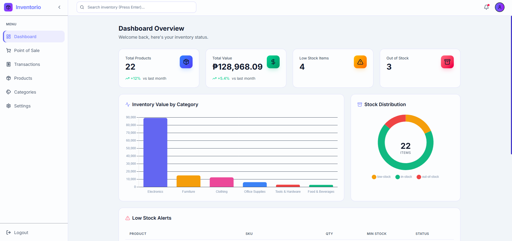
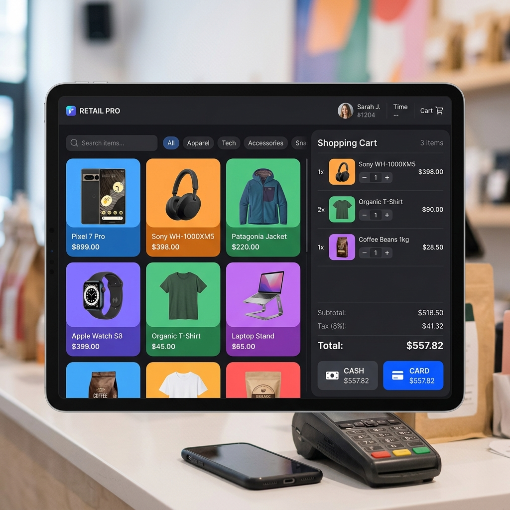
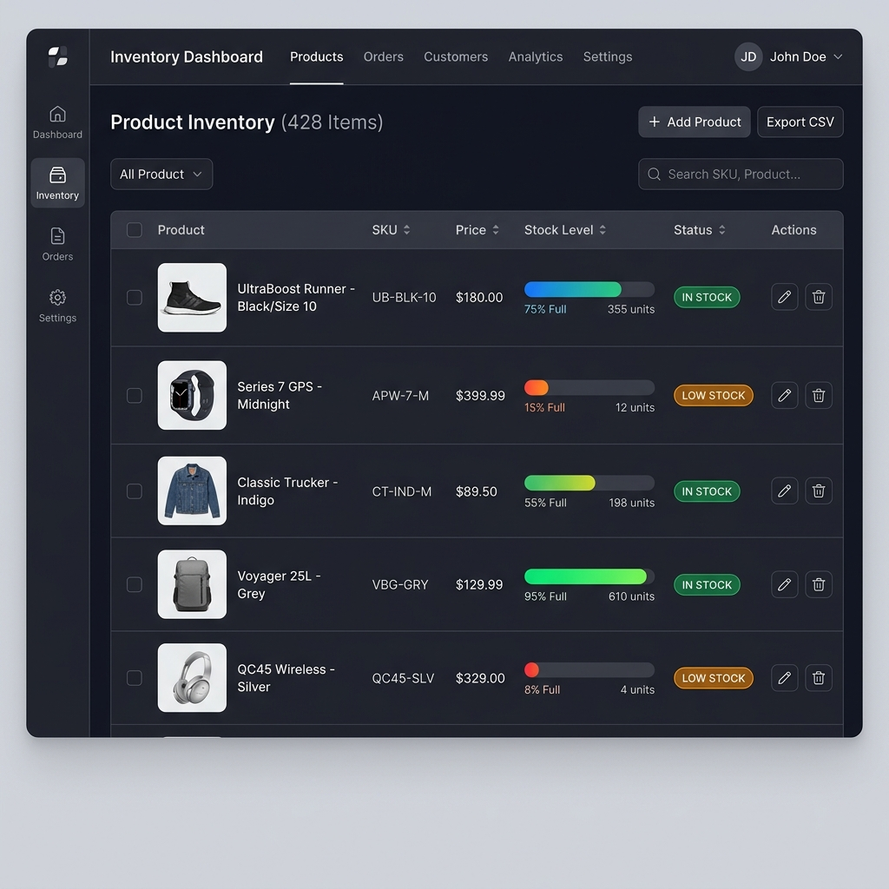
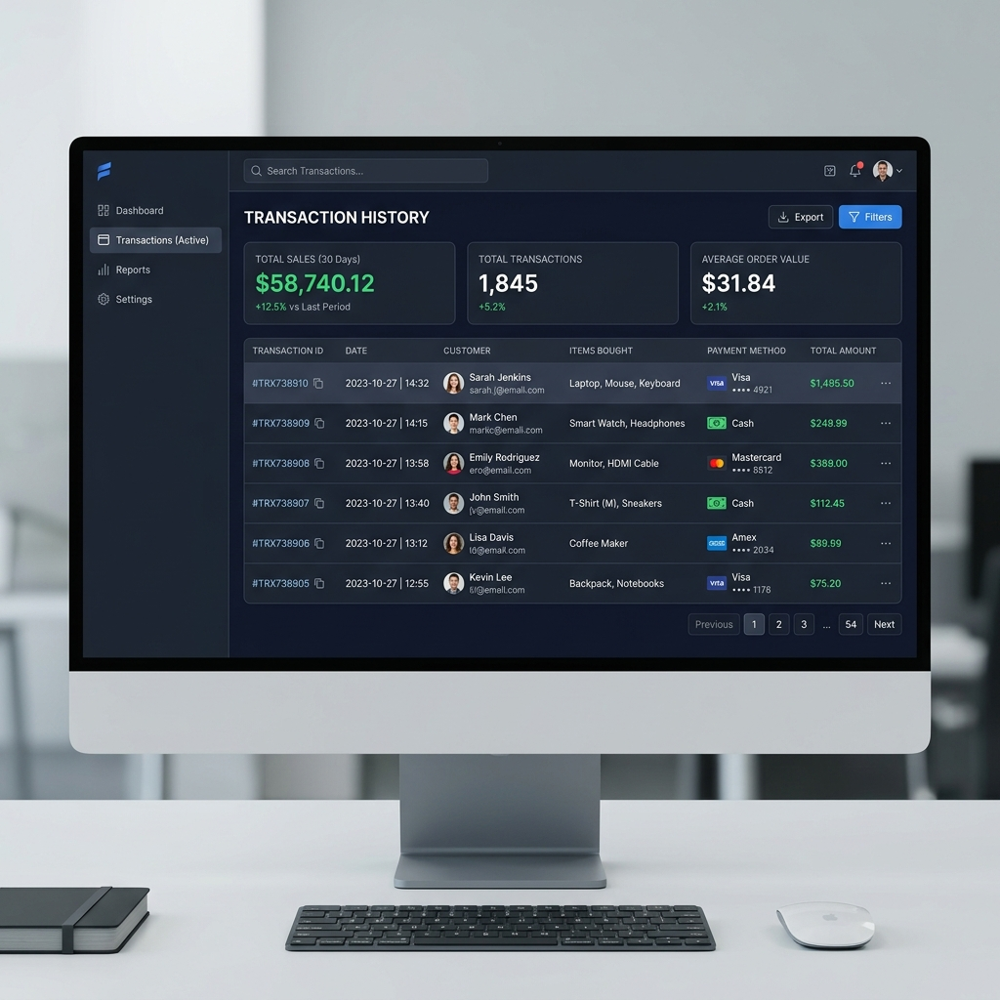

# Inventorio Pro - User Manual

Welcome to **Inventorio Pro**! This user manual will guide you through the core features of the inventory management dashboard, from checking stock levels to processing point-of-sale (POS) transactions.

---

## 1. Dashboard Overview

The **Dashboard** is your command center. It gives you an immediate bird's-eye view of your business operations.

### Key Features:
- **Total Products & Revenue Stats**: Quickly see how many unique items you track and your total gross revenue.
- **Low Stock Alerts**: An actionable table that instantly flags any products that have fallen below their minimum stock threshold, complete with visual gauge meters.
- **Stock Value Chart**: Visualize your stock's estimated value to keep track of capital tied up in inventory.

---

## 2. Point of Sale (POS)

The **Point of Sale** system allows you to ring up walk-in customers quickly.

### Processing a Sale:
1. **Search & Filter**: Use the top search bar or the category dropdown to find products instantly.
2. **Add to Cart**: Click on any product tile on the left grid. A badge will appear on the product showing how many you've added.
3. **Manage Cart**: In the right-hand panel, adjust quantities using the `+` and `-` buttons or remove items entirely.
4. **Checkout**: Select your payment method (Cash or Card) and click the **Checkout** button. The system will automatically log the transaction and deduct the items from your live inventory.

---

## 3. Product Management

The **Products** page is where you manage your entire catalog.

### Managing Your Catalog:
- **Visual Stock Gauges**: Every product has a health bar next to its quantity. Green means healthy stock, yellow means low stock, and red means out of stock.
- **Adding Items**: Click **Add Product** to create a new item. You can set the name, SKU, price, initial stock, minimum stock requirement, assign a category, and upload a product image.
- **Editing & Deleting**: Use the action buttons on the right side of the table to update pricing, correct stock counts, or remove discontinued items.

---

## 4. Transaction History

The **Transactions** page acts as your digital ledger for all processed sales.

### Reviewing Sales:
- **Total Revenue**: The top panel shows an aggregate of all recorded sales.
- **Detailed Ledger**: Every POS checkout creates a permanent record here, detailing the unique Transaction ID, the exact date/time, the items sold, the payment method used, and the total amount.
- **Searchable Ledger**: Easily retrieve past receipts by searching for a specific Transaction ID.

---

## 5. Category Organization

Navigate to the **Categories** tab to organize your inventory effectively.

### Managing Categories:
- **Custom Colors**: Assign custom colors to categories. These colors will automatically highlight products in the POS grid and tables to help you identify items visually.
- **Product Counting**: See exactly how many products are linked to each category to understand your catalog spread.

---

*Thank you for using Inventorio Pro! For any technical issues, please refer to the Github repository.*
